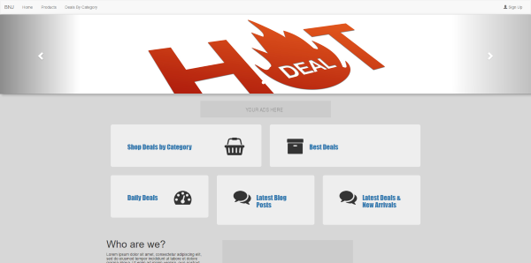

# BNJ - Brand New Jet

 

### Behind the scenes

It's mid-2015'ish, We had over 500 client websites to re-design and re-developed, and I was a bit tired of using HandleBars for unidirectonal-binding, and some extra work to mimic what angularjs was doing, I started creating Micro-boiler plates using an RC version of AngularJS similar has we will do back with knockout or barebones. 

We use a bit more complex version of this one, but nonetheless this was our starting point, Please be-aware these libraries are highly deprecated and I recommend learning the new version of @Angular 8.

I decided to make it public mainly has a reminder of how far along Angular has come, and for some to use has a starting/studying guide.

### Legacy Dependencies :

1) AngularJS 1.5RC (Route, Resource)
2) Bootstrap 3.3.6
3) jQuery 2.2.0
4) Font-Awesome 4.5

